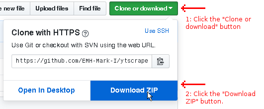
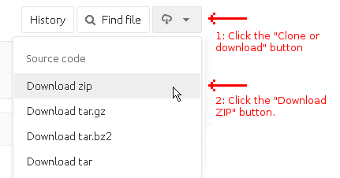
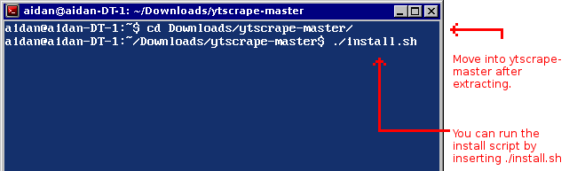

# Install steps for ytscrape

There are two methods to install ytscrape.

- 1: Install by the provided script
- 2: Follow the manual install instructions

#### Install by the provided script

- 1: Download ytscrape.

*GitHub:*

*GitLab:*

- 2: Extract the ZIP file.
- 3: Open the ytscrape-master folder that was extracted.
- 4: Run the `install.sh` script from a terminal. (Note: Optionally you could double click the "YTscrape Installer" if your file manager allows for executing applications.)

*Running install.sh from the terminal*

- 5: The install script will prompt to Press any key to begin the installation.
- 6: After the installation completes press any key to exit. YTscrape is located in /home/your_user/bin and can be invoked from a terminal.

Don't forget to install [mpv player](https://github.com/mpv-player/mpv/) and [youtube-dl](https://rg3.github.io/youtube-dl/) for streaming videos from YTscrape.

#### Install manually

Download ytscrape:

`wget https://github.com/EMH-Mark-I/ytscrape/archive/master.zip`

Download PUP:

`wget https://github.com/ericchiang/pup/releases/download/v0.4.0/pup_v0.4.0_linux_amd64.zip`

Unzip ytscrape:

`unzip master.zip`

Unzip PUP:

`unzip pup_v0.4.0_linux_amd64.zip`

Make a bin/ directory in /home/your_user/

`mkdir -p ~/bin/`

Copy the contents of ytscrape-master/ytscrape/ to the previously created bin/ directory

`cp -R ytscrape-master/ytscrape/* ~/bin`

Copy PUP to the previously created bin/ directory

`cp pup ~/bin`

Note: `~/bin/` will have to be included as a $PATH in your .profile. This is often included by default with most distributions. To verify if `/home/your_user/bin` is an included path, run `echo $PATH` in your terminal.

Don't forget to install [mpv player](https://github.com/mpv-player/mpv/) and [youtube-dl](https://rg3.github.io/youtube-dl/) for streaming videos from YTscrape.