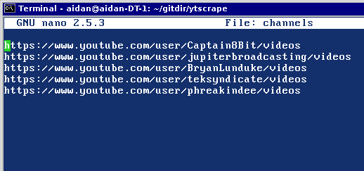

# YTscrape Manual

[Launching YTscrape](#launch)

[Quick start to adding channels](#add_channels)

[Adjusting the list layout](#listlayout)

[Adjusting youtube-dl streaming options](#options)

[How to reset YTscrape to default settings](#reset)

[YTscrape controls](#ytscrape_controls)

[Errors](#errors)

---
<a name="launch"/>
#### Launching YTscrape
YTscrape is a terminal based script. There is no graphical interface, all interactions are handled by character references in a DOS like application.

To run YTscrape open a terminal emulator and insert `ytscrape` in lower-case characters followed by ENTER. Once the script launches you will be presented with a list of options. Each option is activated by inserting its character reference followed by ENTER.

---
<a name="add_channels"/>
#### Quick start to adding channels

Insert option "c" and press return. This will open a channels file in nano where ytscrape will read.

To add YouTube channels, go to the channel in your web browser and copy the "videos" URL directory. Don't copy the `?disable_polymer=1` at the end of the URL. You can paste the URL into the channels file.

GOOD URL: https://www.youtube.com/user/BryanLunduke/videos

BAD URL: https://www.youtube.com/user/BryanLunduke/videos?disable_polymer=1

Note: There are already two example channels included. You can clear these out when adding your own.

---
<a name="listlayout"/>
#### Adjusting the list layout

You will see a list as seen above in the image. Adjusting list layouts will be done in the nano text editor. You can re-organize the list and comment out items that you don't want to see by inserting "#" in front of the desired line. Don't remove any of the lines and try not to edit them unless you know what you're doing.

If you wish to change the text editor used, you can modify the following files.

- ~/bin/ytscrape; replace all instances of "nano" with your preferred text editor.
- ~/bin/youtube/scripts/vidl; replace all instances of "nano" with your preferred text editor.

---
<a name="options"/>
#### Adjusting youtube-dl streaming options

You will see a list as seen above in the image when adjusting the streaming options. The location of the line numbers and colons are important, so don't remove them.

Directory location for video downloads.

- This section contains the directory path in which youtube-dl will save videos.

Directory location for MP3 downloads.

- This section contains the directory path in which youtube-dl will save MP3 audio files.

Video quality settings.

- This section contains the video streaming quality as seen from YouTube. The options provided through YTscrape are 144p - 180p - 240p - 360p - 720p - 720p60 - 1080p - 1080p60 - 1440p - 1440p60 - 2160p - 2160p60. If you insert a streaming quality option that isn't provided or is incorrect, YTscrape will display a warning that you have to fix the error.

MPV display options.

- This section contains the geometry settings for MPV. You can run "man mpv" from a terminal to get a list of different display options in which you can insert here.

---
<a name="reset"/>
#### How to reset YTscrape to default settings

Run ytscrape and insert option "R" and press return. You will be prompted YES/NO to reset. You can use the reset option if you accidentally made an error in the streaming options or list layout files.

---
<a name="ytscrape_controls"/>
#### YTscrape controls
Below is a layout of the control set for YTscrape for reference.

[1] Update list:

To view the list again, insert option 2 and press return. In the list view you will have the option to change the layout of the list and view video info.

[3] View list in spreadsheet:

To stream or download videos, insert option 4 and press return. This will bring you to a new view in which you will have the options to download, stream, adjust list layout, and adjust options. (This will require mpv player and youtube-dl!)

[c] Add / Remove channels:

To change the layout of the list, insert option l (as in lowercase "L.") It will open the list file in nano where you can comment with "#" pound to hide points of time. (Just don't edit the contents of the file.)

[q] Quit:

Insert q and press return to quit.

#### YouTube-dl

[1] Download video:

To stream the video, insert option 2 and press return. Next insert the number as seen beside the URL in the list. If you want to escape the URL number input without streaming the video, insert a "q" and press ENTER to abort.

[3] Download as mp3:

To open the video from a browser, insert option 4 and press return. Next insert the number as seen beside the URL in the list. The selected video will open in the system defulat browser. If you want to escape the URL number input without opening the video in a browser, insert a "q" and press ENTER to abort.

[l] Change list layout:

To view the description of the video (known as the description field on YouTube which is typically located below the video player), insert option i (as in lowercase "I")  and press return. Next insert the number as seen beside the URL in the list and press return. To leave the video description view, press any key on the keyboard.

[o] Options:

To return back to the previous view, insert b.

---
<a name="errors"/>
#### Errors
Below is a list of pottential errors that may be reported by the script.

Note: These will not include many of the errors seen from youtube-dl or mpv, but only the script.

- `EOF`: If you see EOF errors as the list update process finishes, this will occur if there are empty lines in the channels file where youtube channel URLs are stored. These won't impact the functionality of the script, but can cause some unnecessary clutter. To fix this you can remove the empty lines in the channels file.
- `QUALITY_CHECK: $quality_type for this video does not exist! Checking for fallback`: This exists more as a visual note that the video you are attempting to stream or download may not support the quality you have set in the options file. For example, not every video may be in 1440p so the script will attempt to fall back to a lower quality.
- `QUALITY_CHECK: Error, no video qualities are available!`: This error will show up if the video you are attempting to stream or download doesn't provide any known video qualities such as 360p, 720p, 1080p, etc. This failure shouldn't occur unless there were changes made in how youtube-dl lists video statistics or if youtube-dl was unable to obtain statistics for the defined video. As a possible fix to this you can try updating youtube-dl by the folloing method:

-

    If you installed youtube-dl from source, run in a new terminal `youtube-dl -U`. (Note: may require to run as sudo.)
    If you installed youtube-dl by pip, run in a new terminal `sudo pip install --upgrade youtube_dl`.
    If you installed youtube-dl by your package manager, check to see if there are pending updates to be made to your system which might include an update for youtube-dl.

- `QUALITY_CHECK: Error, improper loop exit on false value`: This will occur if the script was interrupted during the fallback process of verifying supported video qualities. To prevent this, allow some time for the script to finish its process unless you are just trying to exit.
- `QUALITY_CHECK: FAIL`: This error indicates that the quality check process failed.
- `VID_CHECK: Error, there are no known video extensions detected for $quality_type`: This will occur if the script was unable to find a video extension to stream or download. Video extensions supported are MP4, webm, and 3gp. MP4 is the default selection unless it doesn't exist. Webm is secondary and 3gp is the final choice the script will fallback to. If none of these extension types exist, that's when the error will occur.
- `VID_CHECK: FAIL`: This error indicates that the vid check process failed.
- `[ffmpeg] tls: The TLS connection was non-properly terminated`: This is an error displayed through mpv not properly closing the TLS socket via youtube-dl. This won't impact the functionality of the script, but can cause some unnecessary clutter. If you allow youtube-dl time, the video should eventually load.
- `[cache] Cache is not responding - slow/stuck network connection?`: This is an error displayed through mpv via youtube-dl. This will occur if your network connection is slow or if youtube is slow to respond. If you allow youtube-dl time, the video should eventually load.