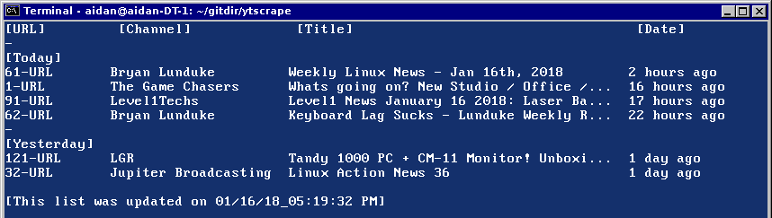

# ytscrape

This is a bash script html scraper that can be used as an alternative to having a Google account for subscribing to YouTube channels. You can view a list of the most recent uploads across multiple channels from a single list within the terminal or a spreadsheet. The attempt of the script is to emulate the "Subscriptions" page from YouTube which aggregates a listing of video uploads from channels you are subscribed to.  

#### Requirements (New Requirments!)

[youtube-dl](https://rg3.github.io/youtube-dl/)

[pup HTML parser](https://github.com/EricChiang/pup)

[mpv player](https://github.com/mpv-player/mpv/)

BASH

Linux

#### Known Issues
• Live videos won't show in the list when linking the /videos YouTube channel URL.

• Quality ranges for the script have been set for only 180p, 360p, 720p, and best (which is mpv default.) DASH quality options are not included since their files are split and not possible to stream.

• If you're following a large number of channels, it can take a while for the script (using wget) to obtain each of the channels.

• HTML and XML character references might occasionally appear in video titles and descriptions. Report it as an issue along with a link to the YouTube video causing the issue.

• Quotes are removed from titles in the list view to prevent issues when sorting.

• The shell window will need to be atleast 860 pixels wide or else the shell will attempt to wrap text which can cause confusion in reading the list.

• To exit URL input options, just insert a q and press return. If a video tries to download or stream you can press `CTRL+C` and it will exit the download.

## Setup

Enable the execute permission bit for the "ytscrape" file.

`chmod +x ytscrape`

The ytscrape executable needs to be located along side the `youtube` directory. If the `youtube` directory is missing, the script will fail.

Move the executable script and the youtube directory into /home/$USER/bin, and you will be able to run the script from anywhere in your shell. (Don't copy this into /usr/bin or any directories that would require root access to modify. At the moment ytscrape requires write access to its `youtube` directory in order to store and retrieve information.)

`cp ytscrape ~/bin && co -r youtube ~/bin`

#### Install pup

Pup is an HTML parsing application that ytscrape will use to parse HTML channel files. This will be required to use ytscrape.

`wget https://github.com/ericchiang/pup/releases/download/v0.4.0/pup_v0.4.0_linux_amd64.zip`

`unzip pup_v0.4.0_linux_amd64.zip`

`cp pup ~/bin` or `cp pup /usr/bin`

## Adding channels

• Run ytscrape and insert option "c" and press return. This will open a channels file in nano where ytscrape will read.

• To add YouTube channels, go to the channel in your web browser and copy the "videos" URL directory. Don't copy the `?disable_polymer=1` at the end of the URL.

GOOD URL: https://www.youtube.com/user/BryanLunduke/videos

BAD URL: https://www.youtube.com/user/BryanLunduke/videos?disable_polymer=1

## How to use script

[1] Update list:

• To get a list of the latest videos from the provided channels, insert option 1 and press return. The script will fetch the web content of the channel URLs and paste it in a list when it completes.

[2] View list:

• To view the list again, insert option 2 and press return. In the list view you will have the option to change the layout of the list and view video info.

[3] View list in spreadsheet:

• This option will open the list in a spreadsheet via Libreoffice libcalc.

[4] YouTube-dl:

• To stream or download videos, insert option 4 and press return. This will bring you to a new view in which you will have the options to download, stream, adjust list layout, and adjust options. (This will require mpv player and youtube-dl!)

[c] Add / Remove channels:

• This will open a channels file in nano where ytscrape will download its list from. Just paste the URLs of the channel on each line, save, then exit nano.

[l] Change list layout:

• To change the layout of the list, insert option l (as in lowercase "L.") It will open the list file in nano where you can comment with "#" pound to hide points of time. (Just don't edit the contents of the file.)

[q] Quit:

Insert q and press return to quit.

### YouTube-dl

[1] Download video:

• To download a video, insert option 1 and press return. Insert the number as seen beside the URL in the list. (Note: The default download location will be /home/$USER/.)

[2] Stream video:

• To stream the video, insert option 2 and press return. Next insert the number as seen beside the URL in the list.

[3] Download as mp3:

• To download a video as an mp3 file, insert option 3 and press return. Next insert the number as seen beside the URL in the list. The default download location is /home/$USER/.

[4] Open video in browser:

• To open the video from a browser, insert option 4 and press return. Next insert the number as seen beside the URL in the list. The selected video will open in the system defulat browser.

[l] Change list layout:

• To change the layout of the list, insert option l (as in lowercase "L") and press return. It will open the list file in nano where you can comment with "#" pound to hide points of time. (Just don't edit the contents of the file.)

[i] Display video info

• To view the description of the video (known as the description field on YouTube which is typically located below the video player), insert option i (as in lowercase "I")  and press return. Next insert the number as seen beside the URL in the list and press return. To leave the video description view, press any key on the keyboard.

[o] Options:

• To adjust options for youtube-dl and mpv download quality settings or locations, insert option o (as in lowercase "o.") It will open the options file in nano where you can add a custom path for download locations with youtube-dl, video quality settings for both mpv and youtube-dl, and mpv window size. When you close the file, it will reload the script to account for any changes made.

[b] back:

• To return back to the previous view, insert b.

#### Credits

EMH-Mark-I
