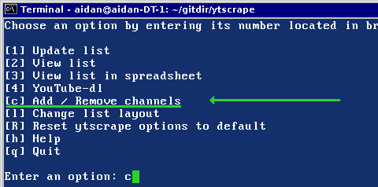
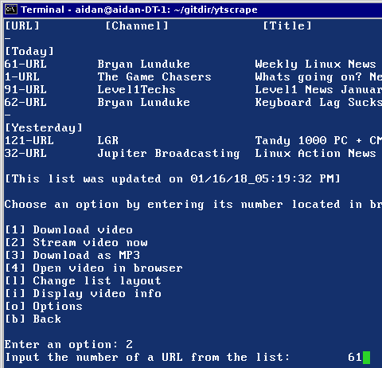

# ytscrape

This is a bash script html scraper that can be used as an alternative to having a Google account for subscribing to YouTube channels. You can view a list of the most recent uploads across multiple channels from a single list within the terminal or a spreadsheet. The attempt of the script is to emulate the "Subscriptions" page from YouTube which aggregates a listing of video uploads from channels you are subscribed to.  

#### Requirements

youtube-dl

mpv player

#### Known Issues
• Streaming videos with mpv might not always work due to youtube occasionally using different formats. Quality ranges for the script have been set for 180p, 360p, 720p, and best (which is mpv default.) I left out DASH options since those don't seem to always work, and due to audio being split from video. I'll might setup an easy way to just copy the whole URL to clipboard so that you can use it however you want outside of the script.

• If you're following a large number of channels, it can take a while for the script (using wget) to obtain each of the channels.

• To exit URL input options, just put a q or any letter and press return.

## Setup

Enable the execute permission bit for the "ytscrape" file.

`chmod +x ytscrape`

### Adding channels

• To add YouTube channels, go to the channel in your web browser and copy the "videos" URL directory.

• Run ytscrape and insert option "c" and press return. This will open a channels file in nano where ytscrape will read. Just paste the URLs, save, then exit nano.

### How to use script

[1] Update list:

• To get a list of the latest videos from the provided channels, insert option 1 and press return. The script will fetch the web content of the channel URLs and paste it in a list when it completes.

[2] View list:

• To view the list again, insert option 2 and press return. In the list view you will have the option to change the layout of the list.

[3] View list in spreadsheet:

• This option will open the list in a spreadsheet via Libreoffice libcalc.

[4] YouTube-dl:

• To stream or download videos, insert option 4 and press return. This will bring you to a new view in which you will have the options to download, stream, adjust list layout, and adjust options. (This will require mpv player and youtube-dl.)

[c] Add / Remove channels:

• To add or remove YouTube channels, insert option c and press return. This will open a channels file in nano where ytscrape will read. Just paste the URLs, save, then exit nano.

[l] Change list layout:

• To change the layout of the list, insert option l (as in lowercase "L.") It will open the list file in nano where you can comment with "#" pound to hide points of time. (Just don't edit the contents of the file.)

[q] Quit:

Insert q and press return to quit.

### YouTube-dl

[1] Download video:

• To download a video, insert option 1 and press return. Insert the number as seen beside the URL in the list. (Note: The default download location will be /home/$USER/.)

[2] Stream video:

• To stream the video, insert option 2 and press return. Insert the number as seen beside the URL in the list.

[3] Download as mp3:

• To download a video as an mp3 file, insert option 3 and press return. Insert the number as seen beside the URL in the list. The default download location is /home/$USER/.

[4] Open video in browser:

• To open the video from a browser, insert option 4 and press return. Insert the number as seen beside the URL in the list. The selected video will open in the system defulat browser.

[l] Change list layout:

• To change the layout of the list, insert option l (as in lowercase "L.") It will open the list file in nano where you can comment with "#" pound to hide points of time. (Just don't edit the contents of the file.)

[o] Options:

• To adjust options for youtube-dl and mpv download quality settings or locations, insert option o (as in lowercase "o.") It will open the options file in nano where you can add a custom path for download locations with youtube-dl, video quality settings for both mpv and youtube-dl, and mpv window size. When you close the file, it will reload the script to account for any changes made.

[b] back:

• To return back to the previous view, insert b.

#### Credits

EMH-Mark-I
